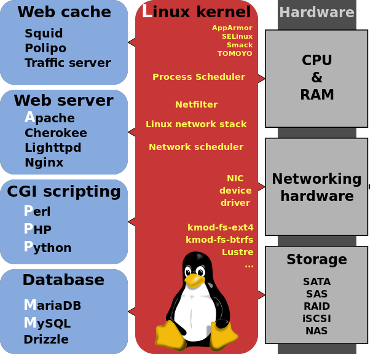

Starting Rust From A Scripting Background
=========================================

3/2/2016

Follow Along: http://rust-from-a-scripting-background.readthedocs.org/en/latest/

Welcome!
--------

You:

* Have coded a bit?
* Have used an interpreted language?
* Are interested in Rust!

We (pdxrust):

* ~30 Rust users from the Portland area
* Follow the Rust code of conduct
* Have the Servo team here this week!

Tonight
-------

What you can't get from the book:

* Context of why and when to use Rust
* Comfort with basic syntax and error messages
* Contacts + new friends

.. note:: 

    Rust is an extremely feature-rich language and introductions are
    usually taught in 1-2 full days of workshops. The best we can do in 1 hour
    is build your interest and motivation, and make sure you know what
    questions to ask as you get involved.

Systems Components and Programming
----------------------------------

.. figure:: _static/mobo.png

.. note::

    Let's make sure we're all on the same page about some stuff you might
    never have needed to think about before.

    tl;dr, computers are dumb but compilers are smart.

Memory
------

RAM is quick to access but impermanent

Disk is slower to access but more permanent

Stack & Heap are abstractions for how a program manages its own memory

(https://en.wikipedia.org/wiki/Data_segment#/media/File:Typical_computer_data_memory_arrangement.png)

CPU
---

* Read an instruction from the program, then
    * Store and fetch bits from registers, or
    * Do math on some bits that it has available, or
    * Store and fetch bits from RAM and disk, then
    * Read the next instruction
* Plus some optimizations

Assembly Language
-----------------

* CPUs have various Instruction Set Architectures

* Instructions are represented by assembly language commands

* Compiler turns programming language into instructions valid for the
  target CPU

* Compilers & interpreters optimize code and guess what you meant. They're
  usually right.

**To write smaller and faster programs, you have to think harder about exactly
what the CPU is doing.**

Compiled vs Interpreted Languages
---------------------------------

**Compiled:**

* Transformed into machine code **before** execution
* Executable is usually platform-specific
* Some errors are caught during compilation

**Interpreted:**

* Transformed into machine code **during** execution
* Source is usually platform-agnostic
* Errors show up when you get there

.. note::

    Choose a compiled language when:

        * Speed/performance is essential
        * Can't afford runtime crashes
        * Targeting an embedded platform with ~0 storage/memory

    Choose an interpreted lanaguage when:

        * You're more fluent in it and need the code done fast
        * Code performance isn't essential
        * Some cases of targeting multiple platforms

Systems vs Application Programming
----------------------------------

**Systems programming:** (assembly, C, C++, Rust)

* Hardware access & performance
* Interface between machine and applications

**Applications programming:** (Python, Ruby, Java)

* User-facing, higher-level languages
* Often interpreted

.. note::

    Systems programming prioritizes speed and performance, and traditionally
    has expected programmers to memorize all the rules for how not to make
    mistakes.

Systems vs Application Code
---------------------------

(https://en.wikipedia.org/wiki/LAMP_%28software_bundle%29#/media/File:LAMP_software_bundle.svg)

.. note:: 

    Systems code (ie kernel, drivers, etc) is pretty much all C today.

Rust vs Other Systems Languages
-------------------------------

**Other languages**

* Expect the programmer to prevent errors
* Concurrency as a last resort
* Older = more supported platforms/libraries
* Minimal visibility into subtle bugs until you hit them

**Safe Rust:**

* Code which compiles is guaranteed to avoid certain errors
* Makes concurrency easier
* Points out everything that even looks like bugs

.. note::

    If you're just getting started and targeting a normal platform (or want to
    add support for your obscure favorite), Rust is like an automated mentor

    If you're contributing to an existing code base in another language or
    hunting a job at a C++-only shop, the things you learn from Rust will
    improve your code, but it might not be your best choice

Debugging Rust vs Others
------------------------

**Applications programming languages**

* Most bugs are logic errors

**Other systems languages:**

* Find memory use errors (sometimes) after code compiles
* Logic errors are still around; fixing introduces memory use errors

**Safe Rust:**

* Code with memory use errors does not compile
* Bugs in safe Rust which compiles are more like those in applications programming

Safe vs Unsafe Rust
-------------------

.. figure:: _static/nested-boxes.png
    :align: center

.. note::

    Imagine that it's possible to enumerate every valid program (valid = free from
    memory mismanagement bugs, use-after-free errors, array out of bounds, etc.).
    The set of programs which the Rust borrow checker accepts is slightly smaller,
    but guaranteed to be contained within, the set of all valid programs.

    What happens when you want to write code that you can prove is valid, but the
    borrow checker won't accept? Use the `unsafe` keyword to take down the
    metaphorical guard rails for a small section of code.

    When you're starting out, try to write only safe Rust. In cases where you
    must use `unsafe`, be sure to understand why.

The Rust Ecosystem
------------------

.. note:: 

    Now we're on the same page about the basic concepts of systems
    programming, let's take a high-level look at some things you'll need to
    know about Rust to start using it

Channels
--------

* Stable
* Beta
* Nightly

"The stable release channel will provide pain-free upgrades, and the nightly
channel will give early adopters access to unfinished features as we work on
them."

.. note::

    http://blog.rust-lang.org/2014/10/30/Stability.html

Libraries
---------

.. figure:: _static/crates-logo.png
    :align: right

* Cargo is the package manager (pip, gem, npm, bower are package managers)
* Libraries are called `crates`
* http://doc.rust-lang.org/stable/book/crates-and-modules.html

Rustaceans
----------

* Find people on http://rustaceans.org/
* https://www.rust-lang.org/conduct.html applies to...
* https://users.rust-lang.org/ is the "mailing list"
* https://www.reddit.com/r/rust/
* https://twitter.com/rustlang
* irc.mozilla.org, #rust, #rust-beginners
* https://github.com/rust-lang/rust
* http://stackoverflow.com/questions/tagged/rust

Installation Options
--------------------

Just want to try it out?

* https://play.rust-lang.org (online, no crates, easy to link)

Need one version, with Cargo?

* https://www.rust-lang.org/downloads.html

Need several versions? 

* https://github.com/brson/multirust (name will eventually change to rustup)

Your First Rust Project
-----------------------

.. code-block:: c++

    $ cargo new myproject

OR

.. code-block:: c++

    $ multirust run stable cargo new myproject

THEN

.. code-block:: c++

    $ vim myproject/src/lib.rs

* https://areweideyet.com/

Let's Write Rust!
=================

http://rustbyexample.com/

http://doc.rust-lang.org/stable/book/

https://github.com/carols10cents/rustlings

https://github.com/ctjhoa/rust-learning

.. note::

    This part is basically section 4 of The Book (http://doc.rust-lang.org/stable/book/syntax-and-semantics.html)
    but skipping as much as possible.

Basic Syntax
------------

.. code-block:: c++

    // Main takes no arguments and returns nothing
    fn main(){
        // The function body is the *scope* inside these curly braces
        // Create a variable. It owns a string.
        let what_to_say = "Hello World";
        // Meet print syntax
        println!("This program says {}", what_to_say);
    }

http://rustbyexample.com/primitives/literals.html

.. note::

        basic_syntax.rs
        http://rustbyexample.com/primitives/literals.html

        4.1. Variable Bindings
        4.2. Functions
        4.3. Primitive Types
        4.4. Comments
        4.32. Operators

Scope Errors!
-------------

.. code-block:: c++

    fn not_main(){
        let what_to_say = "Hello World";
    }
    fn main(){
        println!("This program says {}", what_to_say);
    }

.. code-block:: c++

    <anon>:5:42: 5:53 error: unresolved name `what_to_say` [E0425]
    <anon>:5         println!("This program says {}", what_to_say);
                                                      ^~~~~~~~~~~
    <std macros>:2:25: 2:56 note: in this expansion of format_args!
    <std macros>:3:1: 3:54 note: in this expansion of print! (defined in <std
    macros>)
    <anon>:5:9: 5:55 note: in this expansion of println! (defined in <std macros>)
    <anon>:5:42: 5:53 help: see the detailed explanation for E0425
    error: aborting due to previous error

Punctuation Errors!
-------------------

.. code-block:: c++

    fn main(){
        let what_to_say = "Hello World"
        println!("This program says {}", what_to_say);
    }

.. code-block:: c++

    <anon>:6:9: 6:16 error: expected one of `.`, `;`, or an operator, found `println`
    <anon>:6         println!("This program says {}", what_to_say);
                     ^~~~~~~

The compiler catches mistakes...
--------------------------------

.. code-block:: c++

    fn main(){
        let what_to_say = "Hello World"
        println!("Hello");
    }

.. code-block:: c++

    <anon>:4:13: 4:24 warning: unused variable: `what_to_say`,
    #[warn(unused_variables)] on by default
    <anon>:4         let what_to_say = "Hello World";
                         ^~~~~~~~~~~

Hey, Pythonistas!
-----------------

.. code-block:: c++

    fn main(){let what_to_say="Hello World";println!
    ("This program says {}",what_to_say);}

.. code-block:: c++

    fn
    main
    (
        )
    {
    let what_to_say
        =
    "Hello World"
    ;
    println
    !  (
    "This program says {}"
        , what_to_say
    ) ;           }

.. note:: 

    The only whitespace which matters is that which separates tokens.
    ``fnmain`` is different from ``fn main``. Other than that, the compiler
    doesn't enforce any rules, though you can use
    https://github.com/manishearth/rust-clippy and
    https://github.com/rust-lang-nursery/rustfmt for formatting and style
    guidance

Primitive Types
---------------

.. note:: 

    Have you ever been using a language without a strong type system, and
    returned a string from a function where you were expecting to get an int
    out? Rust forbids those bugs.

* signed integers
    * i8, i16, i32, i64 and isize (pointer size)
* unsigned integers
    * u8, u16, u32, u64 and usize (pointer size)
* floating point: 
    * f32, f64
* char: Unicode scalar values, like 'a', 'α' and '∞' (4 bytes each)
* bool: either true or false
* arrays, like [1, 2, 3]
* tuples, like (1, true)

http://rustbyexample.com/primitives.html

Things each type can do are in standard library docs, like
http://doc.rust-lang.org/stable/std/primitive.bool.html

.. note::

    Here we're skipping book sections...

       * 4.11. Structs
       * 4.12. Enums
       * 4.16. Vectors
       * 4.17. Strings

Functions
---------

http://doc.rust-lang.org/stable/book/functions.html

* Return using ``return`` or bare final expression
* If a function returns something, ``->`` tells the type
* Methods are functions attached to objects

Functions have type signatures
------------------------------

* Every type slot is filled by the name of a type
* You can make your own types. http://rustbyexample.com/custom_types.html

Functions example
-----------------

.. code-block:: c++

    fn and(x: bool,  y: bool) -> bool{
        x && y
    }
    fn another_and(x: bool,  y: bool) -> bool{
        return x && y;
    }
    fn main() {
        println!("{}", and(true, false));
        println!("{}", another_and(true, false));
    }

.. note::

        function_and_operator.rs

        4.15. Method Syntax
        4.24. Universal Function Call Syntax

Errors returning values!
------------------------

.. code-block:: c++

    fn and(x: bool,  y: bool) -> bool{
        x && y;
    }
    ...

.. code-block:: c++

    <anon>:1:5: 3:6 error: not all control paths return a value [E0269]
    <anon>:1     fn and(x: bool,  y: bool) -> bool{
    <anon>:2         x && y;
    <anon>:3     }
    <anon>:1:5: 3:6 help: see the detailed explanation for E0269
    <anon>:2:15: 2:16 help: consider removing this semicolon:
    <anon>:2         x && y;
                           ^
    error: aborting due to previous error

Errors if you get the types wrong!
----------------------------------

.. code-block:: c++

    fn and(x: bool,  y: bool) -> bool{
        return  3;
    }
    ...

.. code-block:: c++

    <anon>:2:15: 2:16 error: mismatched types:
     expected `bool`,
        found `_`
    (expected bool,
        found integral variable) [E0308]
    <anon>:2        return 3;
                           ^
    <anon>:2:15: 2:16 help: see the detailed explanation for E0308

* The detailed explanation links are helpful.
  https://doc.rust-lang.org/error-index.html#E0308

Conditionals
------------

.. code-block:: c++

    fn and(x: bool,  y: bool) -> i32{
        if x && y {
            return 3;
        }
        return 0;
    }

Error: You've got to return what you said you would
---------------------------------------------------

.. code-block:: c++

    fn and(x: bool,  y: bool) -> i32{
        if x && y {
            return 3;
        }
        // what if we don't do anything here?
    }

.. code-block:: c++

    <anon>:2:9: 4:10 error: mismatched types:
     expected `i32`,
        found `()`
    (expected i32,
        found ()) [E0308]
    <anon>:2         if x && y {
    <anon>:3             return 3;
    <anon>:4         }
    ...

Matching
--------

.. code-block:: c++

    fn main() {
        let number = 13;
        // TODO ^ Try different values for `number`

        println!("Tell me about {}", number);
        match number {
            // Match a single value
            1 => println!("One!"),
            // Match several values
            2 | 3 | 5 | 7 | 11 => println!("This is a prime"),
            // Match an inclusive range
            13...19 => println!("A teen"),
            // Handle the rest of cases
            _ => println!("Ain't special"),
        }
    }

http://rustbyexample.com/flow_control/match.html

You can do things with match results
------------------------------------

.. code-block:: c++

    fn main() {
        let boolean = true;
        // Match is an expression too
        let binary = match boolean {
            // The arms of a match must cover all the possible values
            false => 0,
            true => 1,
            // TODO ^ Try commenting out one of these arms
        };

        println!("{} -> {}", boolean, binary);
    }

http://rustbyexample.com/flow_control/match.html

Looping
-------

.. code-block:: c++

    fn main() {
        // `n` will take the values: 1, 2, ..., 100 in each iteration
        for n in 1..101 {
            if n % 15 == 0 {
                println!("fizzbuzz");
            } else if n % 3 == 0 {
                println!("fizz");
            } else if n % 5 == 0 {
                println!("buzz");
            } else {
                println!("{}", n);
            }
        }
    }

http://rustbyexample.com/flow_control/for.html

.. note::

        4.5. if
        4.6. Loops
        4.13. Match
        4.14. Patterns
        4.21. if let

Errors with loops: Scope still matters
--------------------------------------

.. code-block:: c++

    fn main() {
        // `n` will take the values: 1, 2, ..., 100 in each iteration
        for n in 1..101 {
            ...
        }
        println!{"{}", n}
    }

.. code-block:: c++

    <anon>:14:24: 14:25 error: unresolved name `n` [E0425]
    <anon>:14         println!{"{}", n}
                                     ^
    <std macros>:2:25: 2:56 note: in this expansion of format_args!
    <std macros>:3:1: 3:54 note: in this expansion of print! (defined in <std
    macros>)
    <anon>:14:9: 14:26 note: in this expansion of println! (defined in <std
    macros>)
    <anon>:14:24: 14:25 help: see the detailed explanation for E0425

Ownership & Borrowing
---------------------

* Zero-cost abstraction, checks done at compile time don't slow your code

* A variable binding *owns* its value. Sometimes it's ok to let others read or
  write that value, other times it isn't.

* There is a ‘data race’ when two or more pointers access the same memory
  location at the same time, where at least one of them is writing, and the
  operations are not synchronized.

http://doc.rust-lang.org/stable/book/ownership.html

http://doc.rust-lang.org/stable/book/references-and-borrowing.html

The Rules
---------

    First, any borrow must last for a scope no greater than that of the owner.

    Second, you may have one or the other of these two kinds of borrows, but not
    both at the same time:

    * one or more references (&T) to a resource,

    * exactly one mutable reference (&mut T).

(http://doc.rust-lang.org/stable/book/references-and-borrowing.html)

The Obligatory Book Metaphor
----------------------------

* I have a notebook
* I can show it to several friends at once, so they can all read it
* OR I can give it to one friend and they can write in it
* BUT nobody else can read it while anyone is writing in it
* AND if I give it away, it becomes theirs now, and I don't have it any more

What if we broke those rules?

* What if 2 of us try to write at the same time?
* What if someone tries to write while you're reading it?

Borrowing Example
-----------------

.. code-block:: c++

    fn borrow_int(borrowed_int: &i32) {
        println!("I borrowed the int {}", borrowed_int);
    }

    fn main() {
        let my_int : i32 = 42;
        borrow_int(&my_int);
        println!("I still have my int. it's {}.", my_int)
    }

http://rustbyexample.com/scope/borrow.html

.. note::

    (~10mins)

        4.7. Ownership
        4.8. References and Borrowing
        4.9. Lifetimes
        4.26. `const` and `static`
        4.10. Mutability

Borrowing: Simple types are copy.
---------------------------------

.. code-block:: c++

    fn main() {
        let immutable_int = 42;
        println!("immutable_int contains {}", immutable_int);
        let mut mutable_int = immutable_int; // this makes a copy
        println!("mutable_int contains {}", mutable_int);
        println!("immutable_int contains {}", immutable_int);
        mutable_int = 5;
        println!("mutable_int now contains {}", mutable_int);
    }

.. code-block:: c++

    immutable_int contains 42
    mutable_int contains 42
    immutable_int contains 42
    mutable_int now contains 5

Borrowing: Non-Copy types
-------------------------

* It wastes memory to make a copy of a more complex type, so we copy its
metadata.

.. code-block:: c++

    fn main() {
        let immutable = "I'm immutable!".to_string();
        println!("immutable contains {}", immutable);
        let mut mutable = immutable; //move the value, not copy
        println!("mutable contains {}", mutable);
        mutable = "I have been mutated".to_string();
        println!("mutable now contains {}", mutable);
    }

.. code-block:: c++

    immutable_string contains I'm immutable!
    mutable_string contains I'm immutable!
    mutable_string now contains I have been mutated

Borrowing Errors: Can't use after move
--------------------------------------

.. code-block:: c++

    fn main() {
        let immutable = "I'm immutable!".to_string();
        let mut mutable = immutable; //move the value, not copy
        println!("immutable contains {}", immutable);
    }

.. code-block:: c++

    <anon>:5:43: 5:52 error: use of moved value: `immutable` [E0382]
    <anon>:5         println!("immutable contains {}", immutable);
                                                       ^~~~~~~~~
    ...
    <anon>:5:43: 5:52 help: see the detailed explanation for E0382
    <anon>:4:13: 4:24 note: `immutable` moved here because it has type
    `collections::string::String`, which is moved by default
    <anon>:4         let mut mutable = immutable; //move the value, not copy
                         ^~~~~~~~~~~

What we skipped
---------------

* Unsafe
* Concurrency 
* File IO
* Using crates
* The type system

.. note::

       4.18. Generics
        4.19. Traits
        4.22. Trait Objects
        4.23. Closures
        4.27. Attributes
        4.28. `type` aliases
        4.29. Casting between types
        4.30. Associated Types
        4.31. Unsized Types
        4.33. Deref coercions
        4.34. Macros
        4.35. Raw Pointers

What next?
----------

http://rust-from-a-scripting-background.readthedocs.org/en/latest/

* Meet PDX Rustaceans and the Servo team
* Set up Rust
* Join us on IRC (#rust on irc.mozilla.org)
* Write some code!
        * Contribute to the compiler? Mentored bugs at https://public.etherpad-mozilla.org/p/rust-curated
        * Search GitHub issues for language:rust http://bit.ly/24C5JNH
        * Do some exercises: https://github.com/carols10cents/rustlings

