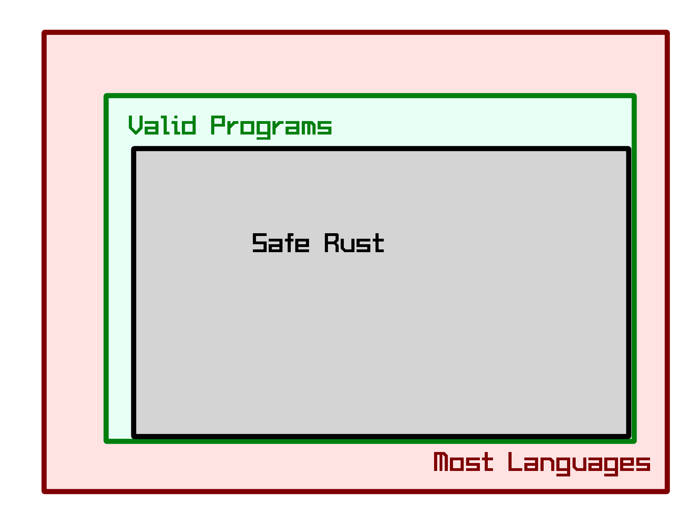

Starting Rust From A Scripting Background
=========================================

3/2/2016

DRAFT SLIDES. Hit ctrl+c to view speaker notes. This is supposed to fit into
an hour. 

Planned cleanup work before presenting includes adding more error messages and
condensed code for each example.

Welcome!
========

You: 

* Have coded a bit?
* Have used an interpreted language?
* Have used a compiled language?

I (edunham):

* Do ops for Rust & Servo
* Have been to a bunch of Rust tutorials
* Studied computer science in university

We (pdxrust):

* ~30 Rust users from the Portland area
* Follow the Rust code of conduct
* Have all kinds of different day jobs

.. note::

    60-minute "hands-on" tutorial with the goal of getting people from an
    intermediate proficiency with a scripting language to basic proficiency 
    with Rust concepts and syntax. Getting help on the interactive examples 
    will have to wait till the second hour of the meeting. 

Computer Anatomy
----------------

.. note:: 

    Let's make sure we're all on the same page about some stuff you might
    never have needed to think about before.

CPU
---

.. TODO: Picture

* Read instructions from the program, then
    * Store and fetch bits from registers
    * Do math on the values represented by those bits
    * Store and fetch bits from RAM and disk
* Plus some optimizations

Memory
------

RAM is quick to access but impermanent

Disk is slower to access but more permanent

Stack & Heap are abstractions for how a program manages its own memory

Assembly Language
-----------------

CPUs have various Instruction Set Architectures

Compiler turns the language you can read into instructions valid for the
target CPU

Compilers optimize code and guess what you meant. They're usually right.

To write smaller and faster code, you have to think harder about exactly what
the CPU is doing.

Compiled vs Interpreted Languages
---------------------------------

Compiled: 

* Transformed into machine code **before** execution
* Executable is usually platform-specific
* Possible to reason about some errors during compilation

Interpreted:

* Transformed into machine code **during** execution
* Source is usually platform-agnostic
* Errors show up when you get there

.. note:: 

    Choose a compiled language when:
    
        * Speed/performance is essential
        * Can't afford runtime crashes
        * Targeting an embedded platform with ~0 storage/memory

    Choose an interpreted lanaguage when:

        * You're more fluent in it and need the code done fast
        * Code performance isn't essential
        * Some cases of targeting multiple platforms

Systems vs Application Programming
----------------------------------

Systems programming:

* Hardware access
* Performance
* Interface between machine and applications
* assembly, C, C++, Rust

Applications programming: 

* User-facing
* Higher-level languages
* Often interpreted
* Python, Ruby, Java

.. note:: 

    Systems programming prioritizes speed and performance, and traditionally
    has expected programmers to memorize all the rules for how not to make
    mistakes.

Rust vs Other Systems Languages
-------------------------------

Safe Rust: 

* Code which compiles is guaranteed to avoid certain errors
* Points out everything that even looks like bugs 
* Makes concurrency easier
* Younger language, learned from older ones

Other languages (C, C++, Assembly):

* Expect the programmer to prevent errors
* Concurrency as a last resort
* Older = more supported platforms/libraries
* Minimal visibility into subtle bugs until you hit them

.. note:: 

    If you're just getting started and targeting a normal platform (or want to
    add support for your obscure favorite), Rust is like an automated mentor

    If you're contributing to an existing code base in another language or
    hunting a job at a C++-only shop, the things you learn from Rust will
    improve your code, but it might not be your best choice

Safe vs Unsafe
--------------

.. note:: 

    Imagine that it's possible to enumerate every valid program (valid = free from
    memory mismanagement bugs, use-after-free errors, array out of bounds, etc.).
    The set of programs which the Rust borrow checker accepts is slightly smaller,
    but guaranteed to be contained within, the set of all valid programs. 

    What happens when you want to write code that you can prove is valid, but the
    borrow checker won't accept? Use the `unsafe` keyword to take down the
    metaphorical guard rails for a small section of code.

    When you're starting out, try to write only safe Rust. In cases where you
    must use `unsafe`, be sure to understand why. 

The Rust Ecosystem
------------------

Stable vs Nightly
-----------------

    "The stable release channel will provide pain-free upgrades, and the nightly
    channel will give early adopters access to unfinished features as we work on
    them."

.. note::

    http://blog.rust-lang.org/2014/10/30/Stability.html

Libraries
---------

* Cargo is the package manager (pip, gem, npm, bower are package managers)
* Libraries are called `crates`

Installation Options
--------------------

.. note:: TODO flowchart

Rustaceans
----------

* Find people on http://rustaceans.org/
* https://www.rust-lang.org/conduct.html applies to...
* https://users.rust-lang.org/ is the "mailing list"
* https://www.reddit.com/r/rust/
* https://twitter.com/rustlang
* irc.mozilla.org, #rust, #rust-beginners
* https://github.com/rust-lang/rust
* http://stackoverflow.com/questions/tagged/rust

Let's Write Rust!
=================

http://rustbyexample.com/

http://doc.rust-lang.org/stable/book/

https://github.com/carols10cents/rustlings

.. note::

    (25 mins)

    This part is basically section 4 of The Book (http://doc.rust-lang.org/stable/book/syntax-and-semantics.html) 
    but skipping as much as possible. 

Basic Syntax 
------------

.. code-block::

    // Main takes no arguments and returns nothing
    fn main(){
        // The function body is the *scope* inside these curly braces
        // Create a variable. It owns a string.
        let what_to_say = "Hello World";
        // Meet print syntax
        println!("This program says {}", what_to_say); 
    }

http://rustbyexample.com/primitives/literals.html

.. note::

    (~5mins)

    Hands-on: Hello World in the playpen which demonstrates each concept
    correctly, then does it incorrectly. Attempt to fix the errors. The correct
    section of the script can be identical to the slide for this part. Goal is
    visual recognition of the very basics, and comfort that error messages aren't
    the end of the world.

        basic_syntax.rs
        http://rustbyexample.com/primitives/literals.html

        4.1. Variable Bindings
        4.2. Functions
        4.3. Primitive Types
        4.4. Comments
        4.32. Operators

Scope Errors!
-------------

.. code-block::                                                                 
       
    fn not_main(){
        let what_to_say = "Hello World";                                        
    }
    fn main(){                                                                  
        println!("This program says {}", what_to_say);                          
    } 

.. code-block:: 

    <anon>:5:42: 5:53 error: unresolved name `what_to_say` [E0425]
    <anon>:5         println!("This program says {}", what_to_say);
                                                      ^~~~~~~~~~~
    <std macros>:2:25: 2:56 note: in this expansion of format_args!
    <std macros>:3:1: 3:54 note: in this expansion of print! (defined in <std
    macros>)
    <anon>:5:9: 5:55 note: in this expansion of println! (defined in <std macros>)
    <anon>:5:42: 5:53 help: see the detailed explanation for E0425
    error: aborting due to previous error

Punctuation Errors!
-------------------

.. code-block:: rust

    fn main(){
        let what_to_say = "Hello World"
        println!("This program says {}", what_to_say); 
    }

.. code-block:: rust

    <anon>:6:9: 6:16 error: expected one of `.`, `;`, or an operator, found `println`
    <anon>:6         println!("This program says {}", what_to_say);
                     ^~~~~~~

Primitive Types
---------------

http://rustbyexample.com/primitives.html

.. note::
        4.11. Structs
        4.12. Enums
        4.16. Vectors
        4.17. Strings

Functions
---------

http://doc.rust-lang.org/stable/book/functions.html

* Return using ``return`` or bare final expression
* If a function returns something, specify what using ``->``
* Methods are functions attached to objects

Functions example
-----------------

.. code-block:: 

    fn and(x: bool,  y: bool) -> bool{
        x && y
    }
    fn another_and(x: bool,  y: bool) -> bool{
        return x && y;
    }
    fn main() {
        println!("{}", and(true, false));
        println!("{}", another_and(true, false));
    } 

.. note::

    Needs diagram to show the boilerplate syntax of specifying types; stay out of
    type system other than that

        function_and_operator.rs

        4.15. Method Syntax
        4.24. Universal Function Call Syntax

Logic
-----

.. code-block:: 

    fn main() {
        // `n` will take the values: 1, 2, ..., 100 in each iteration
        for n in 1..101 {
            if n % 15 == 0 {
                println!("fizzbuzz");
            } else if n % 3 == 0 {
                println!("fizz");
            } else if n % 5 == 0 {
                println!("buzz");
            } else {
                println!("{}", n);
            }
        }
    }

http://rustbyexample.com/flow_control/for.html

.. note::

    (~5mins)

    Hands-on: Some kind of fizz-buzz flavored thing from hackerrank with 1 good
    match statement and 1 bad one that students stare at and fix

        4.5. if
        4.6. Loops
        4.13. Match
        4.14. Patterns
        4.21. if let

Ownership & Borrowing
---------------------

http://doc.rust-lang.org/stable/book/ownership.html

http://doc.rust-lang.org/stable/book/references-and-borrowing.html

* Zero-cost abstraction, checks done at compile time don't slow your code

* A variable binding *owns* its value. Sometimes it's ok to let others read or
  write that value, other times it isn't.

* There is a ‘data race’ when two or more pointers access the same memory
  location at the same time, where at least one of them is writing, and the
  operations are not synchronized.

The Rules
---------

    First, any borrow must last for a scope no greater than that of the owner.

    Second, you may have one or the other of these two kinds of borrows, but not
    both at the same time:

    * one or more references (&T) to a resource,

    * exactly one mutable reference (&mut T).

(http://doc.rust-lang.org/stable/book/references-and-borrowing.html)

Borrowing Example
-----------------

http://rustbyexample.com/scope/borrow.html

.. note::

    (~10mins)

    Hands-on: Trivial playpen examples which only work after you rearrange the
    lines. Probably something from rust by example will need only slight
    modification.

        4.7. Ownership
        4.8. References and Borrowing
        4.9. Lifetimes
        4.26. `const` and `static`
        4.10. Mutability

What we skipped 
===============

* Unsafe
* Concurrency (it's easy, though!)
* File IO
* Using crates
* The type system
 
.. note::

    (5 mins)
    * Unsafe
    * Concurrency (it's easy, though!)
    * File IO
    * Using crates
    * The entire type system: (this list is just here for reference of what the
                               book has that we're leaving out, NOT supposed to be 
                               packed into 5mins) 
        4.18. Generics
        4.19. Traits
        4.22. Trait Objects
        4.23. Closures
        4.27. Attributes
        4.28. `type` aliases
        4.29. Casting between types
        4.30. Associated Types
        4.31. Unsized Types
        4.33. Deref coercions
        4.34. Macros
        4.35. Raw Pointers

What next?
==========

.. note::

    Re-use ecosystem summary slide?
